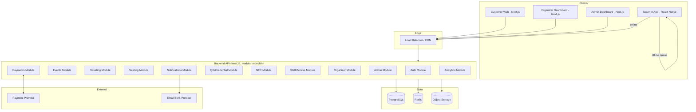
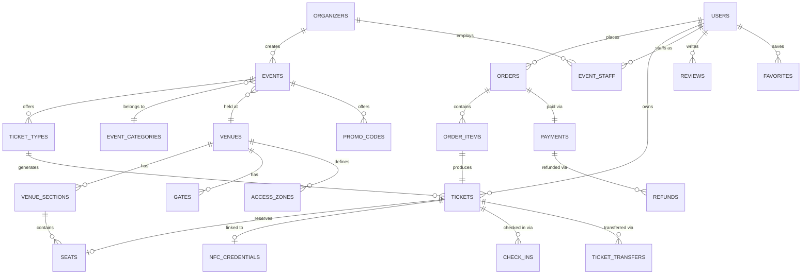

# Event Ticketing Platform — Phase 0: Planning

This is the planning deliverable requested before any code is written. It covers stack, architecture, database, APIs, auth, payments, QR/NFC, deployment, folder structure, phases, MVP scope, security, and testing. No large-scale code follows this document — it's for your review and approval.

---

## 1. Recommended Technology Stack

| Layer | Choice | Why |
|---|---|---|
| Backend language/framework | **Node.js + TypeScript, NestJS** | NestJS gives you an opinionated, modular structure (modules/controllers/services) that scales well across 20+ domains (events, tickets, payments, NFC...) without turning into spaghetti. TypeScript catches a large class of bugs before runtime, which matters a lot in a payment/ticketing system where a wrong type is a wrong charge. |
| Database | **PostgreSQL** | Confirmed by your spec. Strong support for transactions, `SELECT ... FOR UPDATE` row locking (critical for seat/ticket race conditions), CHECK constraints, and JSONB for flexible fields (e.g., event metadata) without abandoning relational integrity. |
| ORM | **Prisma** | Type-safe queries, first-class migrations, readable schema file that doubles as documentation. Supports raw SQL escape hatches for the row-locking logic seat reservation needs. |
| Cache / locks / queues | **Redis** | Used for short-lived seat locks during checkout, rate limiting, and as the backing store for BullMQ background jobs (sending emails, generating QR codes, syncing offline scans). |
| Background jobs | **BullMQ (Redis-backed)** | Ticket generation, email/SMS sending, and analytics rollups shouldn't block the request/response cycle. |
| Frontend (customer + organizer + admin) | **Next.js (React) + TypeScript, Tailwind CSS** | One framework across three surfaces (customer site, organizer dashboard, admin dashboard) as separate apps or route groups. Server-side rendering helps event/SEO pages; React ecosystem has mature QR/seat-map libraries. |
| Scanner app | **React Native (Expo)** | Needs camera access (QR), NFC access, and offline storage — a native/hybrid app is required, not a web page. Expo gets you camera + NFC + SQLite plugins without owning the native build pipeline early on. |
| Local scanner storage (offline) | **SQLite (via Expo)** | Durable local storage for offline scan queues, standard choice for mobile offline-first apps. |
| Auth | **JWT access tokens + refresh tokens, argon2 password hashing** | Argon2 is the current recommended password hash (stronger default than bcrypt against GPU attacks). Short-lived access tokens + rotating refresh tokens limit damage from token theft. |
| Payments | **Provider-agnostic abstraction layer. Primary provider: Wave Business API (Checkout Sessions). Currency: GMD.** | Wave is the dominant mobile money provider in The Gambia, — the country's formal financial inclusion rate reached 82% in 2025, up from 19% in 2019, a shift authorities have credited significantly to Wave's growth there. Their Checkout API is a standard hosted-redirect flow (`POST /v1/checkout/sessions` → redirect the customer to the returned `wave_launch_url` → Wave calls your webhook with an HMAC-signed payload once payment completes), which fits the "never trust the frontend" rule directly: the order only becomes `paid` when the signed webhook arrives. |
| QR generation | **`qrcode` (server-side) encoding a signed, opaque token — not the ticket ID** | Covered in detail in section 10. |
| NFC | **NFC reader SDK on the scanner app (Expo NFC / react-native-nfc-manager) + backend credential service** | Detailed in section 11. |
| File/image storage | **S3-compatible object storage (AWS S3 or Cloudflare R2)** | Event posters, galleries, profile pictures. Keeps large binary data out of Postgres. |
| Email | **Transactional email provider (e.g., Postmark/SendGrid)** | Deliverability for receipts and reminders matters more here than for marketing email. |
| SMS/WhatsApp | **Provider TBD in Phase 12 (e.g., Twilio)** | Deferred — not needed for MVP. |
| Hosting | **Backend + DB: a managed platform (Railway/Render/Fly.io) for early phases, migrate to AWS/GCP for scale. DB: managed Postgres (RDS/Neon/Supabase Postgres).** | Avoids DevOps overhead while the product is unproven; migration path to full cloud exists without a rewrite since everything is containerized. |
| Containerization | **Docker + docker-compose for local dev** | Consistent dev environment across your machine and CI. |
| CI/CD | **GitHub Actions** | Free for reasonable usage, integrates with most hosts above. |

**Why NestJS over a lighter framework (Express/Fastify alone):** this system has 20+ distinct domains (auth, events, tickets, seating, payments, NFC, staff, admin...) that need clean boundaries. NestJS's module system enforces that boundary structurally instead of relying on developer discipline, which matters a lot on a project this large.

**Why one Next.js codebase for three roles instead of three separate apps:** shared component library, shared auth logic, and shared API client cut duplication significantly. Role-based routing (`/customer`, `/organizer`, `/admin`) with middleware guards keeps them logically separate without three repos to keep in sync. If organizer/admin dashboards later need genuinely different release cadences, they can be split out — the initial monolith-frontend doesn't block that.

---

## 2. System Architecture



**Why a modular monolith, not microservices, to start:** microservices add operational overhead (service discovery, distributed transactions, network failure handling) that this project doesn't need yet, and seat-locking/payment logic specifically benefits from being inside one database transaction boundary. NestJS modules give you clean internal seams so specific modules (e.g., NFC, Analytics) can be split into separate services later if load requires it, without a full rewrite.

---

## 3. Database ERD (core entities)



*(Wallets, wallet transactions, and ticket resale are deliberately left out of this diagram — they're Phase 17/Phase 7 additions and will attach to `USERS`/`TICKETS` respectively without changing the core schema above.)*

---

## 4. Database Table List (MVP-relevant tables marked ★)

| Table | Purpose |
|---|---|
| ★ `users` | Customers, organizer account owners, staff, admins — one identity table with a `role` enum, or a `role` plus per-role profile tables. |
| ★ `organizers` | Organizer profile, verification status, linked to a `user`. |
| ★ `events` | Core event record: name, type, dates, status, venue reference. |
| ★ `event_categories` | Concert/Movie/Football/etc. |
| ★ `venues` | Reusable venue. |
| `venue_sections` | Sections within a venue (e.g., "Lower Bowl"). |
| `seats` | Individual seats within a section. |
| `gates` | Physical entry gates for a venue. |
| `access_zones` | Named access levels (Main, VIP, Backstage) per venue/event. |
| ★ `ticket_types` | Regular/VIP/Early Bird etc., scoped to one event, with price + quantity. |
| ★ `tickets` | One row per issued ticket: status, owner, seat (nullable), QR credential, order reference. |
| ★ `ticket_orders` | Order header: customer, totals, payment status. |
| ★ `order_items` | Line items linking an order to ticket types/quantities. |
| ★ `payments` | Payment attempts and their provider-verified status. |
| `refunds` | Refund records linked to payments/orders. |
| `promo_codes` | Discount codes and their rules. |
| `nfc_credentials` | Secure NFC credential records, separate from raw UID. |
| ★ `check_ins` | Append-only log of scan attempts and results. |
| `event_staff` | Staff assigned to an event with a role. |
| `staff_devices` | Registered scanner devices for offline sync accountability. |
| `wallets` | Cashless wallet balance per user (Phase 17). |
| `wallet_transactions` | Ledger of wallet activity — never just mutate a balance. |
| `ticket_transfers` | Transfer history (old owner → new owner). |
| `ticket_resales` | Resale listings (post-MVP). |
| `notifications` | Notification log/queue. |
| `reviews` | Post-event reviews, gated to verified attendees. |
| `favorites` | Saved events/organizers/artists/teams. |
| `audit_logs` | Append-only log of sensitive admin/organizer actions. |

**Key design decisions:**
- `check_ins` and `audit_logs` are **append-only** — never updated or deleted, so they can serve as a source of truth during disputes.
- `tickets.status` is the single authority on validity; `check_ins` and `refunds` reference it but don't duplicate it.
- Seat locking uses a `seats.status` enum (`available`/`locked`/`sold`) plus a `lock_expires_at` timestamp, combined with row-level locking (`SELECT ... FOR UPDATE`) inside the checkout transaction — this is what prevents two customers buying the same seat.
- Money fields are stored as integers in minor units (cents/butut) with a `currency` column, never as floating point.

---

## 5. API Architecture

REST, versioned under `/api/v1`, resource-oriented, JWT bearer auth on protected routes. Representative endpoints (full OpenAPI spec to be generated from NestJS decorators in Phase 1):

```
POST   /api/v1/auth/register
POST   /api/v1/auth/login
POST   /api/v1/auth/refresh
POST   /api/v1/auth/logout

GET    /api/v1/events
GET    /api/v1/events/:id
POST   /api/v1/events              (organizer)
PUT    /api/v1/events/:id          (organizer, owner-only)
POST   /api/v1/events/:id/publish  (organizer, owner-only)

GET    /api/v1/events/:id/ticket-types
POST   /api/v1/events/:id/ticket-types   (organizer)

POST   /api/v1/orders
GET    /api/v1/orders/:id

POST   /api/v1/payments/initiate
POST   /api/v1/payments/webhook    (provider → backend, signature-verified)

GET    /api/v1/tickets/:id
POST   /api/v1/tickets/:id/transfer

POST   /api/v1/nfc/credentials
POST   /api/v1/nfc/validate

POST   /api/v1/check-ins
GET    /api/v1/events/:id/check-ins

POST   /api/v1/refunds
POST   /api/v1/promo-codes
```

Auto-generated Swagger/OpenAPI docs will be served at `/api/docs` in non-production environments from Phase 1 onward.

---

## 6. Frontend Architecture

- **Single Next.js repo, three route groups:** `app/(customer)`, `app/(organizer)`, `app/(admin)`, each behind its own auth middleware checking the user's role.
- **Shared packages** (in a small monorepo, e.g. via pnpm workspaces): `ui` (shared components), `api-client` (typed fetch wrapper generated from the OpenAPI spec), `types` (shared TypeScript types, mirrored from Prisma).
- **State/data fetching:** React Query (TanStack Query) for server state (caching, retries), lightweight local state (React state/Zustand) for UI-only state. No heavy global state library needed at this scale.
- **Seat map rendering:** SVG-based interactive seat map component, seat availability polled/streamed via WebSocket or short-interval polling during checkout to reflect locks in near-real time.

---

## 7. Backend Architecture

- NestJS modular monolith as shown in the diagram above; each module owns its own service/repository layer and exposes a controller.
- **Cross-cutting concerns** implemented as NestJS guards/interceptors: authentication, role-based authorization, request validation (`class-validator`), rate limiting, audit logging.
- **Transactional boundaries:** any operation touching money, seats, or check-ins runs inside a Prisma `$transaction`, with row-level locking where concurrent access is possible (seat purchase, check-in).
- **Background jobs** (BullMQ) handle anything that doesn't need to block the HTTP response: ticket PDF/QR generation, email sending, analytics rollups, offline-scan sync processing.

---

## 8. Authentication Design

- Password hashing: **argon2id**.
- Access token: short-lived JWT (~15 min), contains `userId`, `role`.
- Refresh token: longer-lived, stored hashed in the database, rotated on every use (rotation + reuse detection to catch stolen tokens).
- Roles: `customer`, `organizer`, `staff`, `admin`, enforced via a NestJS `RolesGuard` checked against the route, not just the frontend.
- Staff accounts are scoped to one organizer and one or more events/gates — a `staff` role alone isn't enough context; permissions are checked against the specific event/gate being accessed.
- Email verification required before an organizer can publish events; phone verification optional at MVP, can be added without schema changes (columns already planned in `users`).

---

## 9. Payment Architecture

**Currency:** all monetary values in the system are stored as integer minor units (butut) with `currency = "GMD"`.

**Providers, in build order:**

| Priority | Provider | Role | Notes |
|---|---|---|---|
| 1 (MVP, Phase 6) | **Wave Business API** | Primary — mobile money checkout | Hosted checkout session flow. Needs a Wave Business Account and API key before Phase 6 starts. |
| 2 (post-MVP) | **Bank transfer** | Secondary — manual or bank-API reconciliation | Simpler integration: customer initiates a transfer with a unique reference, organizer/admin (or a bank webhook if the bank offers one) confirms receipt, order flips to `paid`. Treated as a distinct `PaymentProvider` implementation, not a special case. |
| 3 (post-MVP) | **PayPal** | Tertiary — card/international customers | PayPal does not settle in GMD directly, so PayPal-paid orders will need a currency-conversion step (display/charge in USD or another PayPal-supported currency at checkout, store the GMD-equivalent for reporting). This is flagged now so the `PaymentProvider` interface is designed to support a provider whose charge currency differs from the order's base currency, rather than retrofitting it later. |

**Wave integration details (Phase 6):**
- `POST /v1/checkout/sessions` with `amount`, `currency: "GMD"` (to be confirmed against Wave's live currency list for your specific Business account — some Wave markets currently quote sessions in XOF even for neighboring countries, so this gets a direct check with Wave support/docs at integration time rather than assumed), `success_url`, `error_url`, and a `client_reference` set to our internal `order_id` for reconciliation.
- Customer is redirected to the returned `wave_launch_url` to complete payment in the Wave app.
- Wave calls our webhook endpoint with an HMAC-SHA256-signed payload (`Wave-Signature` header); we verify the signature before trusting the payload.
- Refunds go through `POST /v1/checkout/sessions/:id/refund`.

**Provider abstraction:** a `PaymentProvider` interface (`initiate`, `verify`, `refund`) is defined once in the Payments module; Wave, then bank transfer, then PayPal are added as separate implementations behind it — the rest of the system (orders, tickets) never talks to a specific provider directly.

**Order flow (provider-agnostic):** order created in `pending` state → payment initiated with the chosen provider → customer completes payment → **provider webhook or confirmed reconciliation event**, signature-verified where applicable, is the only thing that flips an order to `paid` → tickets are generated only after that confirmation. The frontend reporting "success" never changes order state by itself.

Idempotency keys on payment initiation prevent duplicate charges from retried requests. Refunds go through the same provider abstraction and automatically flip linked tickets to `refunded`.

---

## 10. QR Architecture

- QR codes encode a **signed, opaque credential** (e.g., a random 256-bit token stored hashed in `tickets.qr_credential_hash`), never the raw ticket ID or any guessable data.
- Validation flow (scanner → backend, all server-side):
  `credential → lookup ticket → check ticket status → check event/date match → check zone permission → check not already used → record check-in atomically → return VALID/ALREADY_USED/INVALID/etc.`
- The check-in write and the ticket-status read happen inside one transaction with row locking, so two simultaneous scans of the same ticket can't both succeed (this is the same race-condition class as seat purchase, solved the same way).

---

## 11. NFC Architecture

- Mirrors the QR design: a dedicated `nfc_credentials` table holds a secure token tied to a ticket, **not** the NFC chip's raw UID (UIDs are often clonable/readable without protection).
- Flow: `NFC tap → scanner reads secure token → backend validates token → looks up linked ticket → same validation pipeline as QR → access decision`.
- Credential lifecycle supported: issue, assign to ticket, validate, revoke, replace (for lost wristbands/cards) — all logged in `audit_logs`.
- QR remains the fallback path if NFC hardware/validation fails at a gate.

---

## 12. Deployment Architecture

- Docker images for the NestJS backend and Next.js frontend; `docker-compose` for local dev (Postgres, Redis, backend, frontend).
- Environments: `development` → `staging` → `production`, fully separate databases and secrets per environment.
- CI (GitHub Actions): lint → type-check → test → build on every PR; deploy on merge to `main` (staging) and on tagged release (production).
- Secrets managed via the hosting platform's secret manager — never committed to Git (`.env.example` only, real `.env` gitignored).
- Managed Postgres with automated daily backups from day one, even in staging.

---

## 13. Folder Structure

```
event-ticketing-platform/
├── apps/
│   ├── backend/                 # NestJS
│   │   └── src/
│   │       ├── auth/
│   │       ├── users/
│   │       ├── organizers/
│   │       ├── events/
│   │       ├── ticket-types/
│   │       ├── tickets/
│   │       ├── seating/
│   │       ├── orders/
│   │       ├── payments/
│   │       ├── qr/
│   │       ├── nfc/
│   │       ├── check-ins/
│   │       ├── staff/
│   │       ├── admin/
│   │       ├── notifications/
│   │       ├── analytics/
│   │       └── common/           # guards, interceptors, filters
│   ├── web/                      # Next.js (customer/organizer/admin)
│   │   └── app/
│   │       ├── (customer)/
│   │       ├── (organizer)/
│   │       └── (admin)/
│   └── scanner/                  # React Native (Expo)
├── packages/
│   ├── ui/
│   ├── api-client/
│   └── types/
├── prisma/
│   ├── schema.prisma
│   └── migrations/
├── docker-compose.yml
├── .github/workflows/
└── docs/
    ├── architecture.md
    ├── api.md
    └── database.md
```

---

## 14. Development Phases

Your Section 36 phase list (0 through 22) is sound and I'll follow it as written, with one adjustment worth flagging: **Phase 7 (QR) and Phase 8 (Seating)** have a dependency in practice — seat-level tickets need a seat reference before a QR credential is meaningful for reserved-seating events. I'll implement general-admission QR ticketing fully in Phase 7, then extend it to seat-bound tickets as part of Phase 8, rather than treating them as fully independent. Everything else in your phase list is unchanged.

### Roadmap additions (agreed after Phase 9)

These came out of reviewing the Phase 9 dashboard. They're slotted around the existing phases rather than renumbering them.

| When | Addition | What it involves |
|---|---|---|
| Right after Phase 10 — **done** (see `docs/storage.md`) | **Edit event + banner upload** | An "edit event" screen in the organizer dashboard (the `PUT /events/:id` API exists since Phase 4; there's no UI for it yet). Image upload for the existing `Event.posterUrl` / `bannerUrl` fields: object storage (Section 1), type/size validation, crop and preview. A full banner *designer* (templates, text, colours) is a later, separate feature once uploads work. |
| With the customer storefront / seat-picking checkout | **Visual venue maps (templates)** | Admin-maintained drawings of well-known venues (e.g. the national stadium, cinemas) that every organizer reuses — the Phase 8 model where venue layouts are shared, admin-managed data. Adds geometry the current schema lacks: a shape per section on a venue plan, seat positions or row curves, and landmarks (pitch, stage, screen). Customer view is two-level: whole venue with sections coloured by price/availability → tap a section → pick seats. Needs floor plans, photos or sketches of each real venue to draw accurately. |
| Before the customer storefront is built | **Brand foundations** | Logo, colours, typography and tone settled first, because the storefront is customer-facing and expensive to restyle afterwards. The organizer UI already draws its colours and spacing from shared CSS variables (`apps/web/app/globals.css`), so it picks up the brand largely for free. |
| After real organizers have used it | **Design pass on organizer / staff / admin screens** | Tailor layouts to how organizers actually work, based on their feedback, rather than polishing screens that features are still changing. Functional changes to the dashboard (missing fields, numbers, workflow) are made as they come up, not deferred. |
| After launch prep (decided 6 Oct 2026) | **Bantaba buyer app (Android) with NFC tap entry** | The buyer's Android phone acts as an NFC card (host card emulation) and is tapped on the staff phone; the code it sends changes every few seconds, so screenshots don't work. Same checks and offline list as QR; QR stays for everyone, and iPhones use QR (Apple only allows this in a few countries). The app also has My tickets without signal and reminders. The website launches first with QR; the app follows as the faster way in. Needs the Bantaba Host app built as its own app (not Expo Go). |
| Later, once there are many users (decided 6 Oct 2026) | **Phase 11: NFC entry (wristbands and cards)** | Not built until Bantaba has a large user base. The plan stands: a wristband linked to a ticket at a box office or pickup point (the QR then stops working), tap at the gate with the same checks and offline list as QR, cancel and replace lost bands; NTAG215/216 first, DESFire with cashless. Needs the Bantaba Host app built as its own app (not Expo Go) for NFC. Tapping buyers' own phones comes with Apple/Google Wallet tickets. The `nfc_credentials` table is already in the schema. |
| On hold (decided 1 Oct 2026) | **Phase 17: NFC cashless wristbands / wallet** | Not started until the core app has proven stable with real events. NFC *entry* credentials (Phase 11, no money involved) are a separate decision. |
| Phase 11 (NFC), first task | **Hardware-scanner input** | Web scanner's code box keeps focus and submits on Enter, so a handheld's built-in 2D scanner in "keyboard" mode can scan hands-free. Only needed if handhelds are bought; the mobile apps would use the device's scanner SDK directly. |
| After Phase 10, before/alongside Phase 11 | **Organizer & staff mobile apps (iOS + Android)** | Separate app on the same backend; performance first. Start with one React Native (Expo) app, measure it against agreed performance targets in a scanner bake-off, and switch to two native apps (Swift/SwiftUI, Kotlin/Compose) if it falls short. Prerequisites: OpenAPI spec, `/api/v1` versioning, mobile sign-in, minimum-version check. Full plan: `docs/mobile-apps.md`. (Replaces the earlier idea of wrapping the web scanner with Capacitor.) |
| Before Phase 11 starts | **Choose handheld hardware** | Off-the-shelf Android handhelds / POS devices with built-in 2D scanner and NFC (makers such as Sunmi, Zebra, Honeywell, Urovo); we build software only, never hardware. Pick the device and the NFC credential type together — see "Handheld hardware checklist" below. Pilot 1–2 units against the Phase 10 checklist before buying in bulk. |
| Later, optional | **Third-party gate integration** | For venues that already own turnstiles/access control: per-device API keys (`StaffDevice`, in the schema since Phase 2), a stable versioned validation endpoint, offline allowlist export (Phase 16). Our own app on handhelds stays the primary path. |

**Handheld hardware checklist** (what matters for this system when shortlisting devices):

- Android with Chrome and ideally Google Play services — runs the web scanner as-is; installs the mobile app normally.
- Built-in 2D imager with a keyboard-wedge mode **and** a developer SDK.
- NFC reader supporting ISO 14443 A/B and MIFARE (Classic / DESFire) — decides which wristbands/cards Phase 11 can use.
- Wi-Fi **and** 4G — venue Wi-Fi often fails under crowd load; offline scanning isn't until Phase 16.
- Full-day battery (hot-swappable if possible) and a drop/dust rating.
- Built-in receipt printer only if box-office / door sales are wanted later.
- Local availability of units, spares and repairs in The Gambia / the region.
- Taking card payments on the device is a separate project (certified payment terminal + provider; relates to the Phase 17 NFC wallet), not part of scanning.

**Shortlist (researched 1 Oct 2026; prices are indicative, check local distributors before buying):**

| Device | Type | Scanner / NFC | Android | Approx. price | Verdict |
|---|---|---|---|---|---|
| **Sunmi L3** | Rugged handheld | Dedicated 2D engine; NFC ISO 14443 A/B + 15693 | 14, GMS | €480–545 | **Recommended for gates.** IP68, 4G, hot-swappable 5000 mAh battery, 6.8" screen |
| **Sunmi V3H** (scanner variant) | Handheld POS with 58 mm printer | Dedicated 2D decoder (scanner variant only; base model is camera-only); EMV-certified NFC | 13, GMS | Quote-based | For a **box office**: sell, print, scan. 419 g |
| **Zebra TC22** (TC27 = 4G) | Enterprise handheld | SE4710 / SE55 engines; NFC | Current | $1,200–1,650 | Premium build and long security support (LifeGuard); 2–3× the price |
| **Honeywell EDA52** | Rugged handheld | S0703 imager; NFC; optional 4G | 11, upgradeable to 13 only | Mid-range | Durable but already on an old Android; not for new purchases |
| Generic Alibaba/Amazon units (e.g. Urovo DT50) | Budget handhelds | Varies | Often 8–9 | Low | **Avoid**: outdated Android without security updates, on a device holding staff sign-ins |

Plan: pilot 1–2 **Sunmi L3** units at the gates (plus one **V3H** only if door sales with printed tickets are wanted), run the Phase 10 checklist on them, then decide. When ordering, confirm the **dedicated-scanner variant** and the **GMS** (Google Play) version. Sources: shopnfc.com (Sunmi L3 listing), rospertech.com (V3H review), barcodegiant.com (Zebra TC22), honeywell.com (EDA52).

---

## 15. Progress Tracking Table (initial state)

| Phase | Status | Progress | Tests | Issues |
|---|---|--:|---|---|
| 0 Planning | COMPLETE | 100% | PASS | None |
| 1 Foundation | NOT STARTED | 0% | - | - |
| 2 Database | NOT STARTED | 0% | - | - |
| 3 Authentication | NOT STARTED | 0% | - | - |
| 4 Event Management | NOT STARTED | 0% | - | - |
| 5 Ticketing | NOT STARTED | 0% | - | - |
| 6 Payments | NOT STARTED | 0% | - | - |
| 7 QR Ticketing | NOT STARTED | 0% | - | - |
| 8 Venues & Seating | NOT STARTED | 0% | - | - |
| 9 Organizer Dashboard | NOT STARTED | 0% | - | - |
| 10 Staff/Scanner App | NOT STARTED | 0% | - | - |
| 11 NFC | NOT STARTED | 0% | - | - |
| 12 Notifications | NOT STARTED | 0% | - | - |
| 13 Refunds & Transfers | NOT STARTED | 0% | - | - |
| 14 Admin Dashboard | NOT STARTED | 0% | - | - |
| 15 Analytics | NOT STARTED | 0% | - | - |
| 16 Offline Scanning | NOT STARTED | 0% | - | - |
| 17 NFC Wallet | NOT STARTED | 0% | - | - |
| 18 Security Audit | NOT STARTED | 0% | - | - |
| 19 Performance Testing | NOT STARTED | 0% | - | - |
| 20 Final QA | NOT STARTED | 0% | - | - |
| 21 Deployment | NOT STARTED | 0% | - | - |
| 22 Production Launch | NOT STARTED | 0% | - | - |

---

## 16. MVP Feature List (Phases 1–10)

- Registration/login/roles (customer, organizer, staff, admin)
- Event CRUD, publish/cancel, search & filtering
- Ticket types, pricing, inventory
- Orders and backend-verified payments
- Secure QR ticket generation, display, download
- Seat maps and reserved seating with locking (for venues that need it)
- Organizer dashboard: events, tickets, sales, staff, check-ins
- Staff/scanner app: login, QR scan, check-in, gate assignment

## 17. Future Feature List (Phases 11–22 and beyond)

- NFC ticketing and access control
- Notifications (email/push/SMS/WhatsApp)
- Refunds and ticket transfers
- Admin dashboard (org verification, event approval, platform monitoring)
- Full analytics suite
- Offline scanning with sync
- NFC cashless wallet
- Ticket resale
- Reviews, favorites, social follow features

---

## 18. Security Plan

- Argon2 password hashing; JWT access + rotating refresh tokens.
- RBAC enforced server-side via guards on every protected route, never trusted from the frontend.
- Input validation on every DTO (`class-validator`) at the API boundary.
- Rate limiting on auth endpoints and check-in endpoints (brute-force and scan-flooding protection).
- Parameterized queries throughout via Prisma (SQL injection protection by construction).
- CORS locked to known frontend origins per environment.
- CSRF protection on any cookie-based session flows (JWT-in-header flows are less exposed but cookie-based refresh tokens will get `SameSite`/`HttpOnly` protection).
- Payment status only changes on verified provider webhooks (signature-checked).
- QR/NFC credentials are random, signed tokens — never derived from or equal to a guessable ID.
- Full audit logging of sensitive admin/organizer/staff actions, append-only.
- Dedicated security audit pass in Phase 18 before launch, covering the full checklist in your Section 32.

## 19. Testing Plan

- **Unit tests** per module (services, especially pricing/discount/refund math).
- **Integration tests** for transactional flows: seat purchase race conditions, duplicate check-in prevention, payment webhook idempotency.
- **E2E tests** (Playwright) for the three critical journeys: customer purchase→check-in, organizer create→publish→sell, admin approve→monitor.
- **Load testing** (Phase 19) specifically targeting concurrent seat purchases and concurrent check-ins at a single gate, since those are the two highest-risk race conditions in the whole system.
- Every phase's own test checklist (as defined in your Section 36) is treated as a gate — a phase isn't marked COMPLETE until its tests pass, per your Section 39 rules.

---

## Approved

- **Currency:** Gambian Dalasi (GMD).
- **Payment providers:** Wave Business API (primary, MVP), with Bank Transfer and PayPal planned as secondary providers behind the same `PaymentProvider` abstraction (Section 9).
- **Tech stack, architecture, and phase sequencing:** approved as written above, including the Phase 7/8 QR-then-seating sequencing note.

One thing to confirm before Wave integration work starts in Phase 6: you'll need a **Wave Business Account and API key** — I'd recommend starting that application now since business-account approval can take some time, so it's ready when Phase 6 arrives.

Phase 0 is now COMPLETE. I'll start **Phase 1 — Project Foundation** next and report back using the format from your Section 38.
